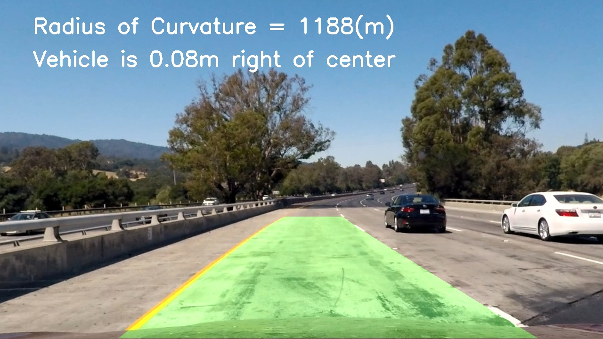

## Advanced Lane Finding
---

Note: this is Udacity Nano Degree project, This project was forked from [Udacity](https://github.com/udacity/CarND-Advanced-Lane-Lines)

## Overview
In this project, I did the following steps:
1. Compute the camera calibration matrix and distortion coefficients given a set of chessboard images.
2. Apply a distortion correction to raw images.
3. Use color transforms, gradients to create a thresholded binary image.
4. Apply a perspective transform to rectify binary image ("birds-eye view").
5. Detect lane pixels and fit to find the lane boundary.
6. Determine the curvature of the lane and vehicle position with respect to center.
7. Warp the detected lane boundaries back onto the original image.
8. Output visual display of the lane boundaries and numerical estimation of lane curvature and vehicle position.

The result will look like below picture:

## Project
* Project wirteup report in [Writeup_report](https://github.com/hankkkwu/SDCND-P2-AdvancedLaneLines/blob/master/Writeup_report.md)
* Code in [Advanced_Lane_Finding](https://github.com/hankkkwu/SDCND-P2-AdvancedLaneLines/blob/master/Advanced_Lane_Finding.ipynb)
* Example output images in [output_images](https://github.com/hankkkwu/SDCND-P2-AdvancedLaneLines/tree/master/output_images)
* Output video in [project_video_result.mp4](https://github.com/hankkkwu/SDCND-P2-AdvancedLaneLines/blob/master/project_video.mp4)
