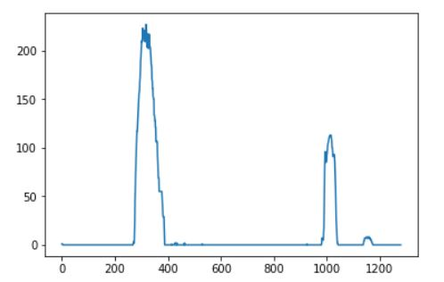
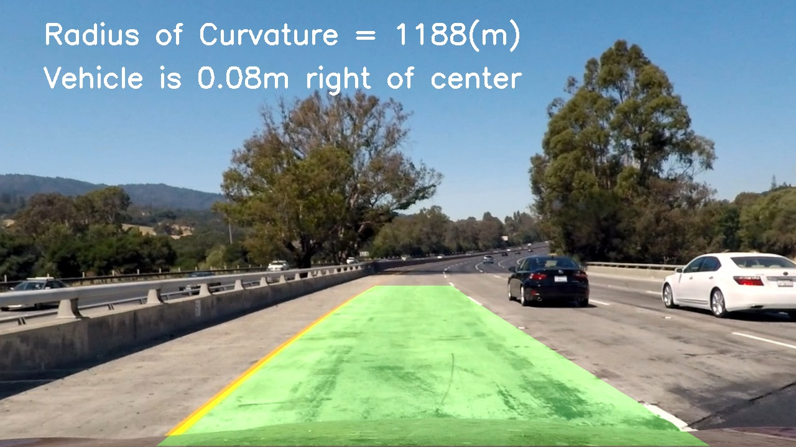

## Advanced Lane Finding

---

**Advanced Lane Finding Project**

The goals / steps of this project are the following:

* Compute the camera calibration matrix and distortion coefficients given a set of chessboard images.
* Apply a distortion correction to raw images.
* Use color transforms, gradients, etc., to create a thresholded binary image.
* Apply a perspective transform to rectify binary image ("birds-eye view").
* Detect lane pixels and fit to find the lane boundary.
* Determine the curvature of the lane and vehicle position with respect to center.
* Warp the detected lane boundaries back onto the original image.
* Output visual display of the lane boundaries and numerical estimation of lane curvature and vehicle position.


## [Rubric](https://review.udacity.com/#!/rubrics/571/view) Points

### Here I will consider the rubric points individually and describe how I addressed each point in my implementation.  

---

### Camera Calibration

#### 1. Briefly state how you computed the camera matrix and distortion coefficients. Provide an example of a distortion corrected calibration image.

The code for this step includes a function called `camera_calibration()` in the first code cell of the IPython notebook in "Advanced_Lane_Finding.ipynb".

I start by preparing "object points", which will be the (x, y, z) coordinates of the chessboard corners in the world. Here I am assuming the chessboard is fixed on the (x, y) plane at z=0, such that the object points are the same for each calibration image.  Thus, `objp` is just a replicated array of coordinates, and `objpoints` will be appended with a copy of it every time I successfully detect all chessboard corners in a test image.  `imgpoints` will be appended with the (x, y) pixel position of each of the corners in the image plane with each successful chessboard detection.  

I then used the output `objpoints` and `imgpoints` to compute the camera calibration and distortion coefficients using the `cv2.calibrateCamera()` function.  I applied this distortion correction to the test image using the `cv2.undistort()` function and obtained this result: 


### Pipeline (single images)

#### 1. Provide an example of a distortion-corrected image.

I apply the distortion correction to one of the test images using the `cv2.undistort()` function and obtained the result like this one:


#### 2. Describe how (and identify where in your code) you used color transforms, gradients or other methods to create a thresholded binary image.  Provide an example of a binary image result.

I used a combination of color and gradient thresholds to generate a binary image (thresholding steps includes a function called `binary_pipeline()` in 5th code cell of the IPython notebook in "Advanced_Lane_Finding.ipynb"). I use l_channel from HLS to detect white lines and set the threshold to 200, then set the lower bound and upper bound of HSV to ([10,100,100],[30,255,255]) to detect yellow lines, and combine the two color threshold imaage with Sobel_x gradient.  Here's an example of my output for this step.  (note: this is not actually from one of the test images)


#### 3. Describe how (and identify where in your code) you performed a perspective transform and provide an example of a transformed image.

The code for my perspective transform includes a function called `perspective_transform()`, which appears in the 6th code cell of the IPython notebook in "Advanced_Lane_Finding.ipynb".  The `perspective_transform()` function takes `binary_image` as inputs an image, and I chose the source points(src) and destination points(dst) in the following manner:

```python
src = np.float32([[211, 719], [575, 460], [710, 460], [1117,719]])
dst = np.float32([[250,gray.shape[0]], [250,0], [gray.shape[1]-330,0],
                  [gray.shape[1]-330,gray.shape[0]]])
```

This resulted in the following source and destination points:

| Source        | Destination   | 
|:-------------:|:-------------:| 
| 211, 719      | 250, 720      | 
| 575, 460      | 250, 0        |
| 710, 460      | 950, 0        |
| 1117, 719     | 950, 720      |

I verified that my perspective transform was working as expected by drawing the `src` and `dst` points onto a test image and its warped counterpart to verify that the lines appear parallel in the warped image.


#### 4. Describe how (and identify where in your code) you identified lane-line pixels and fit their positions with a polynomial?

For finding lane lines, I grab only the bottom half of the image, and adding up the pixel values along each column in the image. The code for my histogram includes a function called `hist()`, which appears in the 7th code cell of the IPython notebook in "Advanced_Lane_Finding.ipynb".



The two most prominent peaks in this histogram will be good indicators of the x-position of the base of the lane lines, we can use that as starting points for where to search for the lines. And use a sliding window, placed around the line centers, to find and follow the lines up to the top of the frame. The code for my sliding window search in `find_lane_pixels()` function, which appears in the 8th code cell of the IPython notebook in "Advanced_Lane_Finding.ipynb", and I fit my lane lines with a 2nd order polynomial (The code includes a function called `fit_polynomial()`, which appears in the 9th code cell of the IPython notebook in "Advanced_Lane_Finding.ipynb") kinda like this:


#### 5. Describe how (and identify where in your code) you calculated the radius of curvature of the lane and the position of the vehicle with respect to center.

I calculated the radius of curvature of the lane by calculating the second dirivitive of the fitted polynomial over the bottom of the fitted line. (In `measure_curvature_real()` function in 13th code cell of the IPython notebook in "Advanced_Lane_Finding.ipynb".) `measure_curvature_real()` function will return the radius of curvature of left lane and right lane, then I averaged them to get a mean radius of curvature (the code in line 14 and 15 in `image_pipeline()` in 14th code cell). 
I used the center of x-position at the bottom of the image and the center of the x-position from the two lane lines I've detected to  calculat the position of the vehicle with respect to center (the code in lines 34 through 39 in `image_pipeline()` in 14th code cell).

#### 6. Provide an example image of your result plotted back down onto the road such that the lane area is identified clearly.

I implemented this step in lines 17 through 32 in my code in the function `image_pipeline()` in 14th code cell.  Here is an example of my result on a test image:



---

### Pipeline (video)

#### 1. Provide a link to your final video output.  Your pipeline should perform reasonably well on the entire project video (wobbly lines are ok but no catastrophic failures that would cause the car to drive off the road!).

Here's a [link to my video result](./project_video_result.mp4)

---

### Discussion

#### 1. Briefly discuss any problems / issues you faced in your implementation of this project.  Where will your pipeline likely fail?  What could you do to make it more robust?

I spent a lot of time on color transform and gradient to create a thresholded binary image. And I realized that I could not have one perfect threshold for every image, so in this project I use the one that can pass the project video. When I used the same threshold for the challenge video, because the road condition is not good ,I could not get a good result. I think maybe deep learning technique can automatically choose the threshold according to the road condition. 
Also I found that my pipeline doesn't work when there is sharp curve, maybe I need another camera to get a better perspective transform.